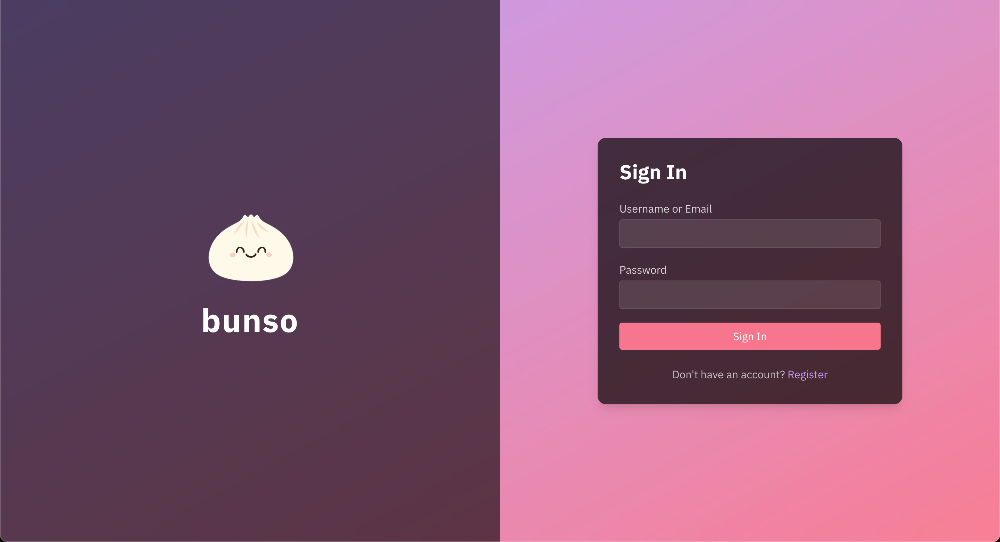
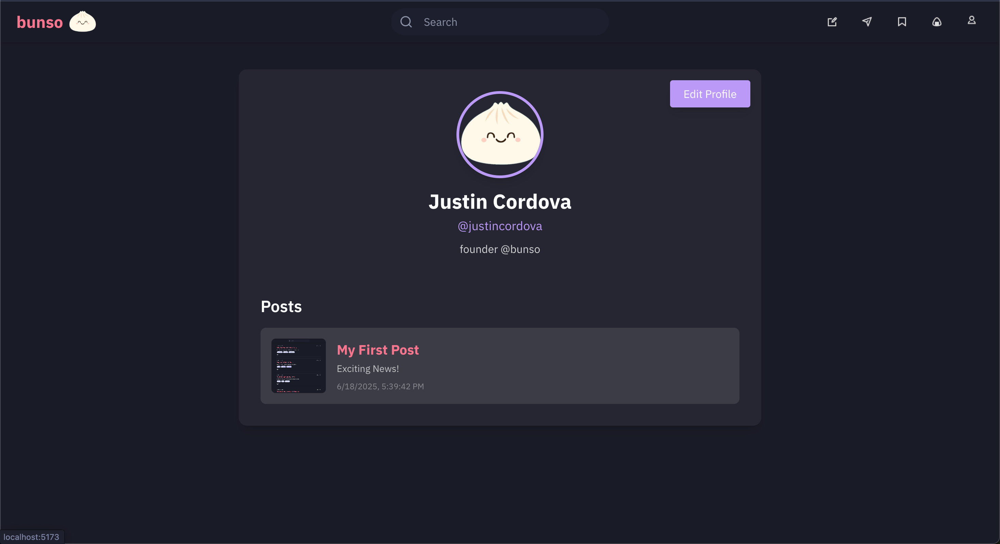

# Bunso

**Bunso** is a modern blog and discussion platform that allows users to share posts, express opinions, and stay connected. It combines the simplicity of writing with the community features you'd expect from a social content app.

## Previews

  
  
  
  

 <!-- optional filler if only 3 images -->

## 🚀 Features

- 📄 **Post Creation**
  - Create posts with a **title**, **body**, and **tags**
  - Upload **images** to visually enhance your content

- 💬 **Messaging System**
  - Direct messaging between users
  - Simple and responsive UI for communication

- 📌 **Bookmarks**
  - Save your favorite posts to revisit later

- 🔔 **Notifications**
  - Get real-time updates for interactions like messages or post activity

- 👤 **User Profiles**
  - View and edit your personal information
  - Display all your posts and bookmarks in one place

## 🛠️ Tech Stack

- **Frontend**: React.js (vite), Tailwind CSS, Redux, FilePond, Axios
- **Backend**: Node.js, Express, Mongoose, Body-Parser, Cors, Dotenv, Nodemon
- **Database**: MongoDB (via Mongoose)
- **Authentication**: Coming soon

## 🧪 Sample API Routes

| Method | Endpoint            | Description               |
|--------|---------------------|---------------------------|
| GET    | `/posts`            | Get all posts             |
| GET    | `/posts/:id`        | Get a single post         |
| POST   | `/posts`            | Create a new post         |
| PATCH  | `/posts/:id`        | Update a post             |
| DELETE | `/posts/:id`        | Delete a post             |